<div align="center">

<!-- Animated Banner -->


<!-- Logo -->
<picture>
  <source media="(prefers-color-scheme: dark)" srcset="https://raw.githubusercontent.com/Sharjeel-Saleem-06/BaatCheet_Android/main/assets/logo.png">
  <source media="(prefers-color-scheme: light)" srcset="https://raw.githubusercontent.com/Sharjeel-Saleem-06/BaatCheet_Android/main/assets/logo.png">
  
</picture>

<br/><br/>

<!-- Animated Title -->


<br/>

<!-- Tagline -->
<h4>
  
  Chat • Code • Image • Voice • Research
  
</h4>

<h5>🌍 Multilingual: Urdu | English | Hindi | Roman Urdu</h5>

<br/>

<!-- Platform Badge -->


<br/><br/>

<!-- Quick Stats -->


<br/><br/>

<!-- Tech Stack Icons -->
<p>
  
</p>

<!-- GitHub Stats -->
<p>
  <a href="https://github.com/Sharjeel-Saleem-06/BaatCheet_Android/stargazers">
    
  </a>
  <a href="https://github.com/Sharjeel-Saleem-06/BaatCheet_Android/network/members">
    
  </a>
  <a href="https://github.com/Sharjeel-Saleem-06/BaatCheet_Android/commits">
    
  </a>
</p>

</div>

---

<!-- Download Section -->
<h2>
  
  Download & Install
</h2>

<div align="center">

<table>
<tr>
<td align="center">

### 🔥 Get BaatCheet Now!

**Distributed via Firebase App Distribution**

<br/>

<a href="mailto:sharry00010@gmail.com?subject=BaatCheet%20App%20Download%20Request">
  
</a>

<a href="https://wa.me/923325760344?text=Hi!%20I%20want%20to%20install%20BaatCheet%20app">
  
</a>

<br/><br/>

> 💡 **Contact me and I'll send you the installation link within minutes!**

</td>
</tr>
</table>

</div>

---

<!-- Features Section -->
<h2>
  
  Powerful Features
</h2>

<table>
<tr>
<td width="50%" valign="top">

###  AI Chat Engine

<details open>
<summary><b>🧠 Real AI Models</b></summary>

| Provider | Models | Speed |
|:---------|:-------|:-----:|
| **Groq** | Llama 3.3 70B Versatile | ⚡⚡⚡ |
| | Llama 3.1 8B Instant | ⚡⚡⚡ |
| | Mixtral 8x7B (32K) | ⚡⚡ |
| | Gemma 2 9B | ⚡⚡ |
| **OpenRouter** | Llama 3.1 70B (Free) | ⚡⚡ |
| | Gemini 2.0 Flash (Free) | ⚡⚡⚡ |
| | Mistral 7B (Free) | ⚡⚡ |
| **DeepSeek** | DeepSeek Chat | ⚡⚡ |
| | DeepSeek Coder | ⚡⚡ |
| **Gemini** | Gemini 2.5 Flash | ⚡⚡⚡ |

</details>

<details>
<summary><b>⚡ Core Capabilities</b></summary>

```
┌─────────────────────────────────┐
│  ✦ Real-time SSE Streaming     │
│  ✦ 50 Messages Context Memory  │
│  ✦ Auto Provider Failover      │
│  ✦ Smart Load Balancing        │
│  ✦ Markdown Rendering          │
│  ✦ Code Syntax Highlighting    │
└─────────────────────────────────┘
```

</details>

</td>
<td width="50%" valign="top">

###  7 Specialized Modes

<details open>
<summary><b>🎯 AI Mode Selection</b></summary>

| Mode | Icon | What It Does |
|:-----|:----:|:-------------|
| **Chat** | 💬 | Natural conversations |
| **Code** | 💻 | Write, debug code |
| **Research** | 🔍 | Web search |
| **Image Gen** | 🎨 | Create images |
| **Tutor** | 📚 | Learning assistant |
| **Creative** | ✍️ | Stories, poems |
| **Math** | 🧮 | Problem solving |

</details>

<details>
<summary><b>🎨 Smart Features</b></summary>

```
┌─────────────────────────────────┐
│  🎯 Automatic Mode Detection    │
│  ⚡ Instant Mode Switching      │
│  💾 Per-Conversation Memory     │
│  🔄 Context-Aware Responses     │
└─────────────────────────────────┘
```

</details>

</td>
</tr>
<tr>
<td width="50%" valign="top">

###  Voice & Language

<details open>
<summary><b>🎙️ Speech Recognition</b></summary>

| Language | Support |
|:---------|:-------:|
| 🇵🇰 Urdu | ⭐⭐⭐⭐⭐ |
| 🇺🇸 English | ⭐⭐⭐⭐⭐ |
| 🇮🇳 Hindi | ⭐⭐⭐⭐ |
| 📝 Roman Urdu | ⭐⭐⭐⭐ |

</details>

<details>
<summary><b>🔊 Text-to-Speech</b></summary>

```
┌─────────────────────────────────┐
│  🇵🇰 URDU VOICES                │
│     ♂ Asad (Natural Male)       │
│     ♀ Uzma (Natural Female)     │
│                                 │
│  🇺🇸 ENGLISH VOICES             │
│     ♂ Guy (American Male)       │
│     ♀ Jenny (American Female)   │
└─────────────────────────────────┘
```

</details>

</td>
<td width="50%" valign="top">

###  Vision & Image AI

<details open>
<summary><b>🎨 Image Generation</b></summary>

| Model | Quality |
|:------|:-------:|
| Z-Image Turbo (FLUX) | ⭐⭐⭐⭐⭐ |
| FLUX Schnell | ⭐⭐⭐⭐⭐ |
| Stable Diffusion XL | ⭐⭐⭐⭐ |
| Playground v2.5 | ⭐⭐⭐⭐⭐ |

</details>

<details>
<summary><b>📸 Vision Features</b></summary>

```
┌─────────────────────────────────┐
│  🔍 Image Analysis (Gemini)     │
│  📝 OCR: 60+ Languages          │
│  📄 Document Scanning           │
│  🖼️ Full-Screen Viewer          │
│  📤 Image Sharing               │
│  📷 Camera + Gallery            │
└─────────────────────────────────┘
```

</details>

</td>
</tr>
<tr>
<td width="50%" valign="top">

###  Team Collaboration

<details open>
<summary><b>👥 Project Features</b></summary>

| Feature | Description |
|:--------|:------------|
| 📁 **Projects** | Unlimited |
| 👥 **Invite** | Via email |
| 💬 **Team Chat** | Real-time |
| ↩️ **Reply** | Quote messages |
| 📷 **Images** | With captions |
| 🗑️ **Delete** | For me / Everyone |

</details>

<details>
<summary><b>👑 Role-Based Access</b></summary>

```
┌─────────────────────────────────┐
│  👑 ADMIN                       │
│     Full control                │
│     Delete any message          │
│                                 │
│  🛡️ MODERATOR                   │
│     Delete own content          │
│                                 │
│  👁️ VIEWER                      │
│     Read-only access            │
└─────────────────────────────────┘
```

</details>

</td>
<td width="50%" valign="top">

###  Analytics & Limits

<details open>
<summary><b>🆓 Free Daily Limits</b></summary>

| Feature | Limit |
|:--------|:-----:|
| 💬 Chat Messages | **50** |
| 🎨 Image Gens | **10** |
| 🎙️ Voice Messages | **10** |

✅ Resets every 24 hours
<br/>✅ No credit card

</details>

<details>
<summary><b>📊 Analytics</b></summary>

```
┌─────────────────────────────────┐
│  📈 Usage Statistics            │
│  📅 Daily/Weekly/Monthly        │
│  🤖 Model Breakdown             │
│  📤 Export Data                 │
└─────────────────────────────────┘
```

</details>

</td>
</tr>
</table>

---

<!-- Architecture -->
<h2>
  
  Architecture

```mermaid
flowchart TB
    subgraph Presentation["🎨 Presentation Layer"]
        Compose["Jetpack Compose<br/>Material 3"]
        ViewModels["ViewModels<br/>StateFlow"]
    end
    
    subgraph Domain["🧠 Domain Layer"]
        UseCases["Use Cases"]
        Repos["Repository<br/>Interfaces"]
        Models["Domain Models"]
    end
    
    subgraph Data["💾 Data Layer"]
        Remote["Retrofit API<br/>OkHttp + SSE"]
        Local["Room DB<br/>DataStore"]
    end
    
    subgraph DI["💉 Hilt DI"]
        Modules["NetworkModule<br/>RepositoryModule"]
    end
    
    Compose --> ViewModels
    ViewModels --> UseCases
    UseCases --> Repos
    Repos --> Remote
    Repos --> Local
    DI --> Presentation
    DI --> Domain
    DI --> Data
```

</h2>



---

<!-- Tech Stack -->
<h2>
  
  Technology Stack
</h2>

<div align="center">

### Core

<p>
  
  
  
</p>

### Architecture

<p>
  
  
  
</p>

### Networking

<p>
  
  
  
</p>

### Storage

<p>
  
  
  
</p>

</div>

<br/>

| Category | Technologies |
|:---------|:-------------|
| **Language** | Kotlin 1.9+ with Coroutines & Flow |
| **UI Framework** | Jetpack Compose with Material 3 |
| **Architecture** | MVVM + Clean Architecture + Repository Pattern |
| **Dependency Injection** | Hilt (Dagger) |
| **Networking** | Retrofit 2 + OkHttp 4 + SSE Streaming |
| **Authentication** | Google Sign-In (Credential Manager) |
| **Image Loading** | Coil Compose with caching |
| **Local Storage** | Room Database + Jetpack DataStore |
| **Navigation** | Compose Navigation |
| **Build** | Gradle KTS with Version Catalog |

---

<!-- Project Structure -->
<h2>
  
  Project Structure
</h2>

<details>
<summary><b>📂 Click to expand</b></summary>

```
📦 com.baatcheet.app
│
├── 📂 data/                        # 💾 Data Layer
│   ├── 📂 api/
│   │   ├── BaatCheetApi.kt         # Retrofit interface
│   │   └── models/ApiModels.kt     # DTOs
│   ├── 📂 repository/
│   │   └── ChatRepository.kt       # API calls
│   └── 📂 local/
│       └── AuthPreferences.kt      # DataStore
│
├── 📂 di/                          # 💉 Dependency Injection
│   ├── NetworkModule.kt            # Retrofit, OkHttp
│   └── RepositoryModule.kt         # Bindings
│
├── 📂 domain/                      # 🧠 Domain Layer
│   ├── 📂 model/
│   │   ├── ChatMessage.kt
│   │   └── User.kt
│   └── 📂 usecase/
│       └── auth/SignInUseCase.kt
│
├── 📂 ui/                          # 🎨 Presentation Layer
│   ├── 📂 auth/
│   │   └── LoginScreen.kt
│   ├── 📂 chat/
│   │   ├── ChatScreen.kt           # 💬 Main chat
│   │   ├── ChatViewModel.kt
│   │   └── VoiceService.kt
│   ├── 📂 projects/
│   │   └── ProjectsScreen.kt       # 👥 Team projects
│   ├── 📂 voice/
│   │   └── VoiceChatScreen.kt      # 🎙️ Voice chat
│   ├── 📂 imagegen/
│   │   └── ImageGenScreen.kt       # 🎨 Image gen
│   ├── 📂 analytics/
│   │   └── AnalyticsScreen.kt      # 📊 Stats
│   ├── 📂 settings/
│   │   └── SettingsScreen.kt       # ⚙️ Settings
│   ├── 📂 components/
│   │   └── MarkdownText.kt         # Markdown renderer
│   └── 📂 theme/
│       └── Theme.kt
│
└── BaatCheetApplication.kt         # 🚀 App entry
```

</details>

---

<!-- Quick Start -->
<h2>
  
  Getting Started
</h2>

<details>
<summary><b>📋 Prerequisites</b></summary>

| Requirement | Version |
|:------------|:--------|
| Android Studio | Hedgehog (2023.1.1)+ |
| JDK | 17+ |
| Android SDK | 26+ (Android 8.0) |
| Kotlin | 1.9+ |

</details>

```bash
# 1️⃣ Clone
git clone https://github.com/Sharjeel-Saleem-06/BaatCheet_Android.git

# 2️⃣ Open in Android Studio
# File > Open > Select folder

# 3️⃣ Sync Gradle
# Click "Sync Now"

# 4️⃣ Run
# Select device/emulator > Click Run (▶)
```

---

<!-- App Info -->
<h2>
  
  App Information
</h2>

<div align="center">

| Property | Value |
|:---------|:------|
| **Package Name** | `com.baatcheet.app` |
| **Min SDK** | 26 (Android 8.0 Oreo) |
| **Target SDK** | 34 (Android 14) |
| **Version** | 1.0.0 |
| **APK Size** | ~14 MB |

</div>

---

<!-- API Endpoints -->
<h2>
  
  Backend API
</h2>

**Base URL:** `https://baatcheet-backend.onrender.com/api/v1/`

| Endpoint | Description |
|:---------|:------------|
| `/chat/completions` | AI chat (SSE) |
| `/chat/vision/analyze` | Image analysis |
| `/chat/ocr/extract` | OCR |
| `/chat/tts` | Text-to-speech |
| `/chat/voice/transcribe` | Speech-to-text |
| `/images/generate` | Image generation |
| `/projects` | Project management |
| `/projects/:id/chat/messages` | Team chat |

---

<!-- Related Links -->
<h2>
  
  Related
</h2>

<div align="center">

<a href="https://baatcheet-web.netlify.app">
  
</a>
<a href="https://github.com/Sharjeel-Saleem-06/BaatCheet">
  
</a>

</div>

---

<!-- Developer Section -->
<h2>
  
  Developer
</h2>

<div align="center">


<br/><br/>

### **Muhammad Sharjeel**
*Full-Stack Developer • Mobile Developer • AI Enthusiast*

<br/>

<a href="mailto:sharry00010@gmail.com">
  
</a>
<a href="https://wa.me/923325760344">
  
</a>

<br/><br/>

<a href="https://muhammad-sharjeel-portfolio.netlify.app/">
  
</a>
<a href="https://linkedin.com/in/sharjeel-saleem">
  
</a>
<a href="https://github.com/Sharjeel-Saleem-06">
  
</a>

</div>

---

<div align="center">

## 📄 License

```
MIT License

Copyright (c) 2026 Muhammad Sharjeel

Permission is hereby granted, free of charge, to any person obtaining a copy
of this software and associated documentation files (the "Software"), to deal
in the Software without restriction, including without limitation the rights
to use, copy, modify, merge, publish, distribute, sublicense, and/or sell
copies of the Software, and to permit persons to whom the Software is
furnished to do so, subject to the following conditions:

The above copyright notice and this permission notice shall be included in all
copies or substantial portions of the Software.

THE SOFTWARE IS PROVIDED "AS IS", WITHOUT WARRANTY OF ANY KIND, EXPRESS OR
IMPLIED, INCLUDING BUT NOT LIMITED TO THE WARRANTIES OF MERCHANTABILITY,
FITNESS FOR A PARTICULAR PURPOSE AND NONINFRINGEMENT.
```

---

<!-- Footer -->


</div>
