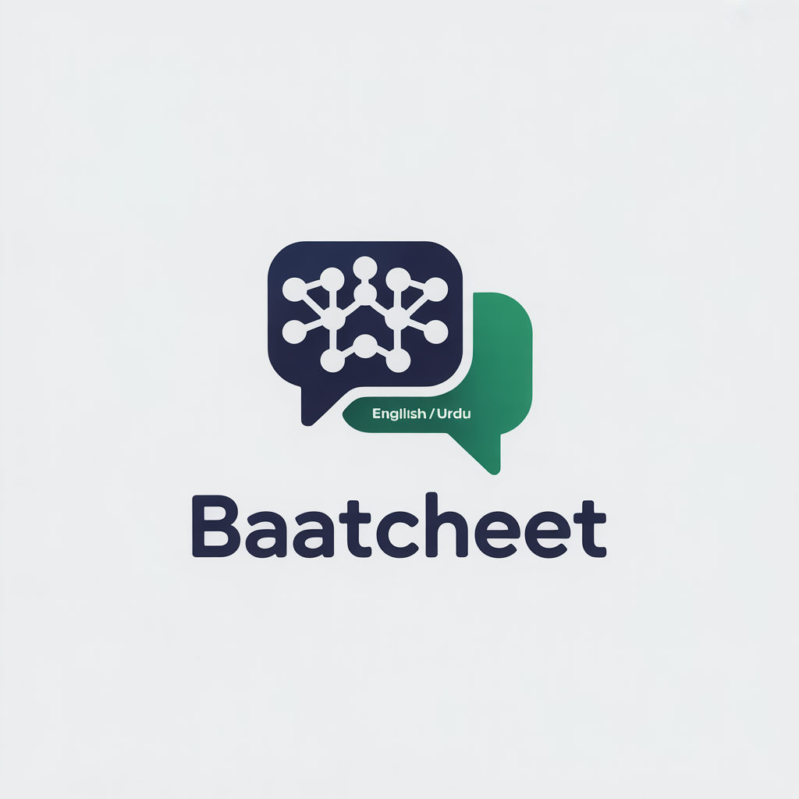

# 🌐 BaatCheet Web - Advanced AI Chat Platform

<p align="center">
  
</p>

<p align="center">
  <strong>🚀 The Most Powerful Free AI Chat Platform</strong><br>
  <em>Your AI That Speaks Your Language - Urdu, English & Roman Urdu</em>
</p>

<p align="center">
  
  
  
  
</p>

<p align="center">
  <a href="https://baatcheet-web.netlify.app">
    
  </a>
</p>

---

## 📥 Try BaatCheet Now!

### 🔗 Live Demo: [baatcheet-web.netlify.app](https://baatcheet-web.netlify.app)

**Want the Android App?** Contact me:

| Contact Method | Details |
|----------------|---------|
| 📧 **Email** | [sharry00010@gmail.com](mailto:sharry00010@gmail.com) |
| 📱 **WhatsApp/Phone** | [+92 332 576 0344](tel:+923325760344) |

---

## 🎬 Platform Demo

### 📹 Full Demo Video - BaatCheet Web

https://github.com/user-attachments/assets/baatcheet-web-demo

<details>
<summary>🎥 Click to expand video description</summary>

- Complete web platform walkthrough
- AI chat with real-time streaming
- Voice input and text-to-speech
- Image generation and analysis
- Team collaboration projects
- Settings and analytics dashboard

</details>

---

## 🌟 Why BaatCheet?

BaatCheet is not just another ChatGPT clone. It's a **complete AI ecosystem** built from scratch with:

- 🆓 **100% Free** - No subscription required, generous daily limits
- 🌍 **Multilingual** - Full Urdu, Hindi, English & Roman Urdu support
- 🎨 **Modern UI** - Beautiful, responsive design with light/dark themes
- 🔐 **Secure** - Enterprise-grade authentication with Clerk
- 🚀 **Fast** - Real-time streaming responses
- 👥 **Collaborative** - Team projects with real-time chat

---

## ✨ Feature Showcase

### 🤖 **AI Chat Engine**

| Feature | Description |
|---------|-------------|
| **100+ AI Models** | Access GPT-4, Claude, Gemini, Mistral, DeepSeek & more |
| **Streaming Responses** | Real-time text generation with typing effect |
| **Context Memory** | AI remembers your entire conversation |
| **Profile Learning** | AI learns your preferences over time |
| **Custom Instructions** | Set AI behavior globally or per-conversation |

### 🎯 **7 Specialized AI Modes**

```
┌────────────────────────────────────────────────────────────┐
│                    AI MODES AVAILABLE                       │
├────────────────────────────────────────────────────────────┤
│  💬 CHAT       │ Natural conversations in any language     │
│  💻 CODE       │ Write, debug, explain code (50+ langs)    │
│  🔍 RESEARCH   │ Web search with citations                 │
│  🎨 IMAGE      │ Generate images from text                 │
│  📚 TUTOR      │ Interactive learning assistant            │
│  ✍️ CREATIVE   │ Stories, poems, scripts                   │
│  🧮 MATH       │ Step-by-step problem solving              │
└────────────────────────────────────────────────────────────┘
```

### 🗣️ **Voice & Language**

- **🎙️ Voice Input** - Speak in Urdu, English, Hindi or Roman Urdu
- **🔊 Text-to-Speech** - 4 natural voices (Asad, Uzma, Guy, Jenny)
- **📝 Real-time Call** - Voice call feature with AI
- **🌐 60+ OCR Languages** - Extract text from any image

### 📸 **Vision & Images**

- **Image Analysis** - Upload any image for AI description
- **OCR Text Extraction** - Extract text from documents, receipts, handwriting
- **Image Generation** - Create AI images with Stable Diffusion
- **Multiple Formats** - JPEG, PNG, WebP, GIF support
- **Drag & Drop** - Easy image upload interface

### 👥 **Team Collaboration (Projects)**

- **Create Unlimited Projects** - Organize work by topic
- **Invite Team Members** - Email-based invitations
- **Role-Based Access**:
  - 👑 **Admin** - Full control, can delete any message
  - 🛡️ **Moderator** - Can edit/delete own messages
  - 👁️ **Viewer** - Read-only access
- **Real-time Team Chat** - Messages, replies, reactions
- **Project Context** - Set AI instructions for the team
- **Settings Panel** - Customize chat behavior

### 📊 **Analytics Dashboard**

- **Usage Statistics** - Messages, images, voice calls
- **Daily/Weekly/Monthly** - Trend charts
- **Provider Breakdown** - See which AI models you use
- **Export Data** - Download your analytics

### ⚙️ **Settings & Customization**

- **Profile Management** - Update name, avatar, bio
- **Light/Dark Theme** - Beautiful in both modes
- **Voice Preferences** - Choose TTS voice & speed
- **Privacy Controls** - Manage data & export
- **Danger Zone** - Delete all data

---

## 🏗️ Technical Architecture

### **Frontend Stack**

```
┌─────────────────────────────────────────────────────────────────┐
│                     BaatCheet Web Frontend                      │
├─────────────────────────────────────────────────────────────────┤
│  React 18 + TypeScript + Vite                                   │
│  ┌──────────────────────────────────────────────────────────┐  │
│  │  UI Layer: Tailwind CSS + Lucide Icons + Framer Motion   │  │
│  └──────────────────────────────────────────────────────────┘  │
│  ┌──────────────────────────────────────────────────────────┐  │
│  │  Auth: Clerk (OAuth, Email, Google Sign-in)              │  │
│  └──────────────────────────────────────────────────────────┘  │
│  ┌──────────────────────────────────────────────────────────┐  │
│  │  State: React Hooks + Context + Local Storage            │  │
│  └──────────────────────────────────────────────────────────┘  │
│  ┌──────────────────────────────────────────────────────────┐  │
│  │  Streaming: Server-Sent Events (SSE) for real-time       │  │
│  └──────────────────────────────────────────────────────────┘  │
└─────────────────────────────────────────────────────────────────┘
```

### **Tech Stack Details**

| Category | Technology |
|----------|------------|
| **Framework** | React 18 with TypeScript |
| **Build Tool** | Vite 5 |
| **Styling** | Tailwind CSS 3 + Custom animations |
| **Icons** | Lucide React |
| **Auth** | Clerk (OAuth, Email, Social) |
| **Routing** | React Router v6 |
| **Markdown** | React-Markdown + Syntax highlighting |
| **Charts** | Recharts |
| **Forms** | EmailJS for contact form |
| **Hosting** | Netlify (Edge Functions) |

---

## 📁 Project Structure

```
frontend/
├── public/
│   ├── logo.png              # App logo
│   └── _redirects            # Netlify SPA config
├── src/
│   ├── components/
│   │   ├── Header.tsx        # Navigation header
│   │   ├── Footer.tsx        # Site footer
│   │   ├── Layout.tsx        # App layout with sidebar
│   │   ├── MarkdownRenderer.tsx  # Rich markdown display
│   │   └── ProjectChat.tsx   # Team chat component
│   ├── pages/
│   │   ├── Chat.tsx          # Main AI chat page
│   │   ├── Home.tsx          # Landing page
│   │   ├── Projects.tsx      # Projects management
│   │   ├── Analytics.tsx     # Usage analytics
│   │   ├── Settings.tsx      # User settings
│   │   ├── AdminPanel.tsx    # Admin dashboard
│   │   ├── Contact.tsx       # Contact form
│   │   ├── Help.tsx          # Help center
│   │   ├── Privacy.tsx       # Privacy policy
│   │   └── Terms.tsx         # Terms of service
│   ├── App.tsx               # Main app with routing
│   ├── main.tsx              # Entry point
│   └── index.css             # Global styles
├── index.html
├── tailwind.config.js
├── vite.config.ts
└── package.json
```

---

## 🚀 Quick Start

### Prerequisites
- Node.js 18+
- npm or yarn

### Installation

```bash
# Clone the repository
git clone https://github.com/Sharjeel-Saleem-06/BaatCheet.git
cd BaatCheet/frontend

# Install dependencies
npm install

# Start development server
npm run dev

# Build for production
npm run build
```

### Environment Variables

Create a `.env` file:

```env
VITE_CLERK_PUBLISHABLE_KEY=pk_live_...
VITE_API_URL=https://sharry121-baatcheet.hf.space/api/v1
VITE_EMAILJS_SERVICE_ID=service_...
VITE_EMAILJS_TEMPLATE_ID=template_...
VITE_EMAILJS_PUBLIC_KEY=...
```

---

## 🌐 Deployment

### Netlify (Recommended)

```bash
# Build
npm run build

# Deploy to Netlify
npx netlify deploy --prod --dir=dist
```

**Live URL:** [https://baatcheet-web.netlify.app](https://baatcheet-web.netlify.app)

---

## 📊 API Integration

The web app connects to BaatCheet Backend:

**API Base URL:** `https://sharry121-baatcheet.hf.space/api/v1/`

### Key Endpoints

| Endpoint | Method | Description |
|----------|--------|-------------|
| `/auth/sync` | POST | Sync user with Clerk |
| `/chat/completions` | POST | Send chat message (streaming) |
| `/chat/vision/analyze` | POST | Analyze images |
| `/chat/ocr/extract` | POST | Extract text from images |
| `/chat/tts` | POST | Text-to-speech |
| `/chat/voice/transcribe` | POST | Voice transcription |
| `/conversations` | GET | List conversations |
| `/projects` | GET/POST | Manage projects |
| `/user/usage` | GET | Get usage statistics |

---

## 📱 Responsive Design

BaatCheet is fully responsive across all devices:

- 📱 **Mobile** - Optimized touch interface
- 📱 **Tablet** - Adaptive sidebar
- 💻 **Desktop** - Full-featured experience

---

## 🔐 Security Features

- ✅ **Clerk Authentication** - Enterprise-grade auth
- ✅ **HTTPS Only** - All traffic encrypted
- ✅ **Input Validation** - XSS & injection prevention
- ✅ **Rate Limiting** - API abuse protection
- ✅ **CORS Configuration** - Secure cross-origin

---

## 🤝 Contributing

1. Fork the repository
2. Create feature branch (`git checkout -b feature/amazing`)
3. Commit changes (`git commit -m 'Add amazing feature'`)
4. Push to branch (`git push origin feature/amazing`)
5. Open Pull Request

---

## 👨‍💻 Developer

<p align="center">
  
</p>

<p align="center">
  <strong>Muhammad Sharjeel</strong><br>
  Full-Stack & Mobile Developer
</p>

| Contact | Link |
|---------|------|
| 📧 **Email** | [sharry00010@gmail.com](mailto:sharry00010@gmail.com) |
| 📱 **Phone/WhatsApp** | [+92 332 576 0344](tel:+923325760344) |
| 🌐 **Portfolio** | [muhammad-sharjeel-portfolio.netlify.app](https://muhammad-sharjeel-portfolio.netlify.app/) |
| 💼 **LinkedIn** | [linkedin.com/in/sharjeel-saleem](https://linkedin.com/in/sharjeel-saleem) |
| 🐙 **GitHub** | [github.com/Sharjeel-Saleem-06](https://github.com/Sharjeel-Saleem-06) |

---

## 📄 License

MIT License - see [LICENSE](LICENSE) for details.

---

<p align="center">
  <strong>Made with ❤️ in Pakistan 🇵🇰</strong>
</p>

<p align="center">
  <a href="https://github.com/Sharjeel-Saleem-06/BaatCheet_Android">📱 Android App</a> •
  <a href="https://github.com/Sharjeel-Saleem-06/BaatCheet">📦 Full Repository</a>
</p>
